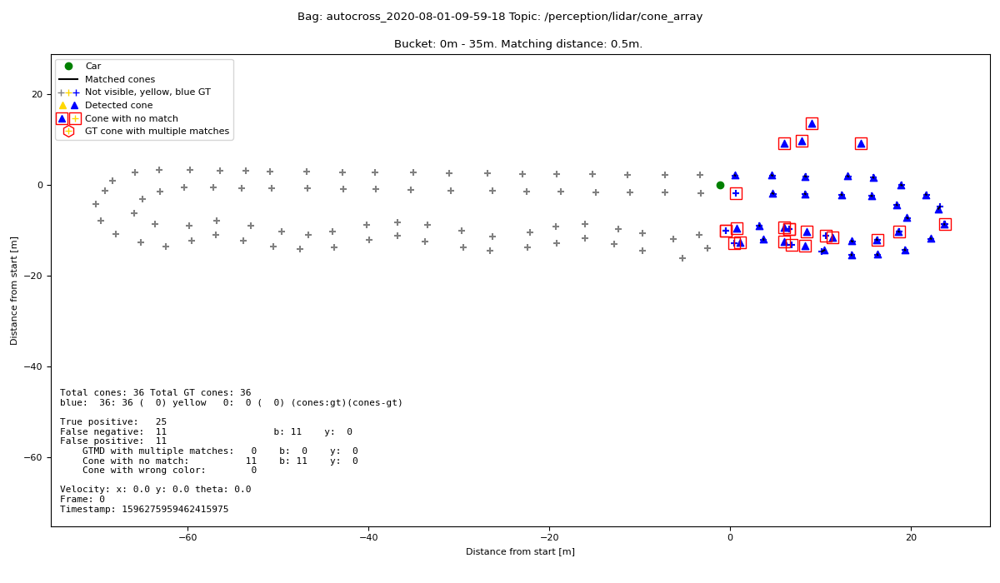

# Perception KPI

## Usage

```
Usage: amz_kpi perception [OPTIONS] ROSBAG GTMD_FILE PIPELINE_TOPIC

Options:
  -cv, --create_video             Toggle to generate a video. Default is off.
                                  Default name is "out.extension" and will
                                  overwrite existing file.

  -tpo, --track_plot_offset INTEGER
                                  Frame offset when track plot and video
                                  should start. Default is the first frame

  -tpe, --track_plot_end INTEGER  End frame for track plot and video. Default
                                  is all the frames

  -tp, --track_plot               Toggle whether the track should be plotted
                                  for each frame

  --framerate INTEGER             Framerate for the output video. Default is
                                  10

  -o, --output TEXT               Output name for plots or videos. Default is
                                  "out.extension"

  --title TEXT                    Title for plots. Default is off
  -ps, --plot_statistics          Toggle to plot statistics. Default is off
                                  and only textual output

  -nc, --no_clean                 Skip cleanup of extracted data
  -ne, --no_extract               Skip extraction of data. This should be used
                                  if the data is already extracted

  -md, --matching_distances TEXT  Maximum matching distance between GTMD and
                                  detected cone. Default is 0.5 . Can be a
                                  comma separated list e.g. 0.2,0.5,1,2

  -lnc, --lidar_no_color          Do not consider color for matching,
                                  all cones are blue. Default is off and
                                  color is considered.

  -h, --help                      Show this message and exit.
```

The most basic way to use the KPI tool is with 3 inputs. The rosbag, the GTMD files, and the pipeline topic. This gives you textual output for the perception target KPI. Visible cones between 0m and 35m that are not further away than 0.5m from GTMD cones:

```
$ amz_kpi perception autocross_2020-08-01-09-59-18.bag 2020-08-01_tuggen.csv /perception/lidar/cone_array
Statistics for 0m - 35m :
        0.5m
                F1 score        :0.6446493045464342
                Mean precision  :0.6572846162169937
                Mean recall     :0.6324906202886927
```

The matching distance can be modified my `-md` or `--matching_distances`. This argument takes a comma separated list values:

```
$ amz_kpi perception autocross_2020-08-01-09-59-18.bag 2020-08-01_tuggen.csv /perception/lidar/cone_array -md 0.2,0.5
Statistics for 0m - 35m :
        0.2m
                F1 score        :0.5657526219662179
                Mean precision  :0.5753053145933956
                Mean recall     :0.5565119843517193
        0.5m
                F1 score        :0.6446493045464342
                Mean precision  :0.6572846162169937
                Mean recall     :0.6324906202886927
```

Normally the tool extracts data to `/tmp/amz` and cleans it after a run. If you want to run the tool multiple time on the same extracted rosbag, you can skip extracting and cleaning up with `-nc` and `-ne` or `--no_clean` and `--no_extract`. For the first run you add `-nc` so that data gets extracted but not cleaned. For the second run you add `-nc -ne` so that data doesn't get extracted and cleaned. The last run should be `-ne` so that you don't extract data but clean up.

```
$ amz_kpi perception autocross_2020-08-01-09-59-18.bag 2020-08-01_tuggen.csv /perception/lidar/cone_array -nc
Extracting data...
rosbag: autocross_2020-08-01-09-59-18.bag
gtmd:   2020-08-01_tuggen.csv
Extracting ROS messages: 100%|████████████████████████████████████████████████████████████████████████████████████████████████████████████████████████████| 135647/135647 [00:07<00:00, 17229.26it/s]
Completed extraction.
Statistics for 0m - 35m :
        0.5m
                F1 score        :0.6446493045464342
                Mean precision  :0.6572846162169937
                Mean recall     :0.6324906202886927

$ amz_kpi perception autocross_2020-08-01-09-59-18.bag 2020-08-01_tuggen.csv /perception/lidar/cone_array -nc -ne -md 2
Statistics for 0m - 35m :
        2.0m
                F1 score        :0.859834427534433
                Mean precision  :0.8781777070986098
                Mean recall     :0.8422417738009399

$ amz_kpi perception autocross_2020-08-01-09-59-18.bag 2020-08-01_tuggen.csv /perception/lidar/cone_array -ne -md 1

Statistics for 0m - 35m :
        1.0m
                F1 score        :0.7819402990161632
                Mean precision  :0.7991825713054396
                Mean recall     :0.7654263141033182
Deleting rosbag extactor's tmp folder...
```

To investigate the run you can plot the track fir individual timestamps with `-tp` or `--track_plot`. By default this opens the plot for every message in the chosen pipeline. You can select the range with `-tpo` or `--track_plot_offset` to select the starting frame and `-tpe` or `--track_plot_end` to select the last timestamp.



The `--title` argument changes the title of the plot in case you want to display custom data.

To create a movie you use `-cv` or `--create_video`. With `--framerate` you can change the framerate and `-tpo` as well as `-tpe` change the start/end frame. You can also use the `--title` argument to change the title of the plot and additionally use `-o` or `--output` to change the name of the output file of the movie. The default fps is 10 and the format is `webm`.
Note that you need to have ffmpeg installed and creating a movie might take up to a few minutes on your system!


## Architecture
The file `run_perception.py` with the function `run_perception()` are the main pieces of the tool. This function loops over every bin, every matching distance, and every frame and computes the statistics. Before the main loop is called, the data is extracted and pre-processed. Optionally a subprocess is launched to create the video.

The GTMD data is extracted in `get_gtmd_cones()` which interpolates the cones using the GNSS data, filters them by FOV and filteres them by bucket distance. Pre-processing of cones and GTMD cones happens with `unpack_cones()`, and `unpack_gtmd_cones()`. Those functions extract the color from the cones and create multiple arrays that are easier to work with than the extracted data straight from the rosbag extractor.

Once all the data is extracted and pre-processed, the function loops over each bin. For each bin it loops over each matching distance and frame. Statistics per frame are stored in a `frame_data` dict which has as key the timestamp. The individual frame statistics are computed in `get_confusion_data()`. This function matches the cones to the GTMD and counts how many are correctly matched, how many are missing, etc. The output of this function is a dictionary with many individual arrays and values from which statistics like "true positives", "precisio",... can be calculated later.
This data is then stored in the `data_by_matching_distance` dict which has as key the matching distance. After each iteration of a distance bucket, the `aggregate_statistics` function takes the data from each bucket and each frame, and computes an aggregated statistics. Currently this is the mean precision, mean recall, and F1 score.

If a plot or video should be produced, then an additional function is called which is in `plot_track.py`. This function transforms the data from egomotion into world frame via GNSS in the `cones_to_worldframe` function. The rest of the function plots the cones, GTMD cones, creates a legend, changes axis,... At the end either the plot is shown, or it is stored in a `BytesIO()` object if the user wants a plot or a video.
