# AMZ_Work Perception
This branch collect all the code development I made as perception core member in AMZ 2021 season. 

For the competition side we won in total 3 first prize and 1 third prize in static design, and 1 sencond prize in dynamic event. 

 

## Introduction

For the perception module itself our goal is to detect cones and estimate their position and color. A sequential sensor-fusion based pipeline is designed for effective utilization of multi-modal data from the minimal sensor setup. In case of sensor failure, there are alternative LiDAR-only or Camera-only pipelines which are automatically activated for resilient recovery of the autonomous mission.
Check the video [here](https://youtu.be/6RJvNTTBE6g)

 

 

Basically in this page you can see all my tasks relevant to AMZ. More numerical details and code belongs to AMZ so you can check most qualitative results here.

- **Interesting exploration**
    - **2D detection with event camera**
    - **Bayesian neural network semnatic segmentation**
- **Main package**
    - **2D cone detection**
        - **Data pipeline**
        - **KPI**
        - **C++ deployment in racing car**
        - **Andropid deployment with phone**
    - **3D sensor fusion detection**
        - **Camera depth approximation**
        - **Ground removal using RANSAC**
        - **Sequential fusion**

## Interesting exploration
### 2D object detection using event camera

Event cameras such as the Dynamic Vision Sensor (DVS) or the Asynchronous Time-based Image Sensor (ATIS) are part of a class of novel optical sensors that asynchronously output the change in the logarithmic light intensity at each pixel. This contrasts conventional image sensors that produce a synchronous measure of the absolute light intensity at all pixels. This novel technology has the promise of facilitating low latency data collection of high-speed motion in environments requiring high dynamic range. In addition, as the event camera emits data only when a change is perceived, low-power applications and mobile deployment become an attractive area of application for the sensor.

Using event camera in racing car will resolve the issue of motion blur. Moreover, event camera can decrease the weight of the sensor setup.
Taking the advantage of [event simulator](https://github.com/uzh-rpg/rpg_esim) we can explore the possibility of using event camera for cone object detection.

 
 

More details can be found [here](https://github.com/qimaqi/events_cone_detector)

### Bayesian neural network semnatic segmentation
Neural networks have enjoyed significant successes in recent years across a variety of domains. Many practitioners claim that to bring neural networks into more high-stakes domains , such as healthcare and self-driving vehicles, neural networks must be able to report the uncertainty in their predictions. An approach for doing this involves using Bayesian Neural Networks (BNNs). BNNs combine Bayesian principles of model averaging with the black-box approach of deep learning. As a result, BNN's predictions often have better calibrated uncertainty in comparison to traditional neural networks.

In this project I implement pytorch version of "What Uncertainties Do We Need in Bayesian Deep Learning for Computer Vision?"

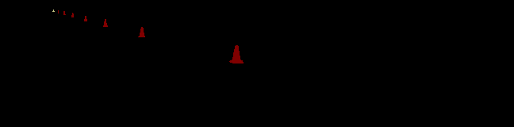

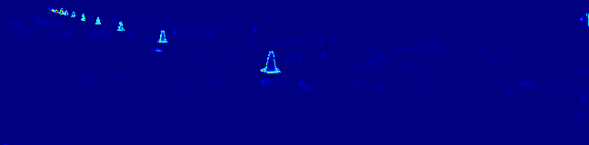

As you can see above the aleatoric is high around the cone boundary. This make sense because the boundary part is related to the measurement precision.

As for Epistemic uncertainty you can see it is larger where cone is far away. This indicates that we have more uncertainty in large range and need more data for that.

## Main Package

### 2D cone detection
The [TinyYOLOv5](https://github.com/ultralytics/yolov5) object detection network is used to detect bounding boxes of 4 different types of cones (blue, yellow, big orange, and small orange). To train the network with the Pytorch framework, we created our own cone bounding box dataset from race-track driving rosbags. The rosbags were collected from varying envi- ronmental conditions and contain cones of all types. The image streams from these rosbags were pre-annotated us- ing pre-trained models from the past and then manually corrected using the [Supervisely online platform](https://supervise.ly/). The network is deployed using ONNX framework for efficient inference, achieving inference times less than 60ms, while detecting cones accurately up to a depth of 40m. Approximate depth of the cones is estimated using the height of bounding box as a proxy.

#### Data pipeline
Data quality is crucial for deep learning performance. In this data pipeline task I increase the yolo performance on our dataset from **accuracy 92% to accuracy 98%**. I first pre labeling with pretrained YOLO in AMZ last season, so I have some bounding boxes already. Then I use Supervisely online platform for manual bounding box annotation. Generating 6998 data from 11 rosbags from 8 testing days with differing illumination, sunlight, and environmental conditions.

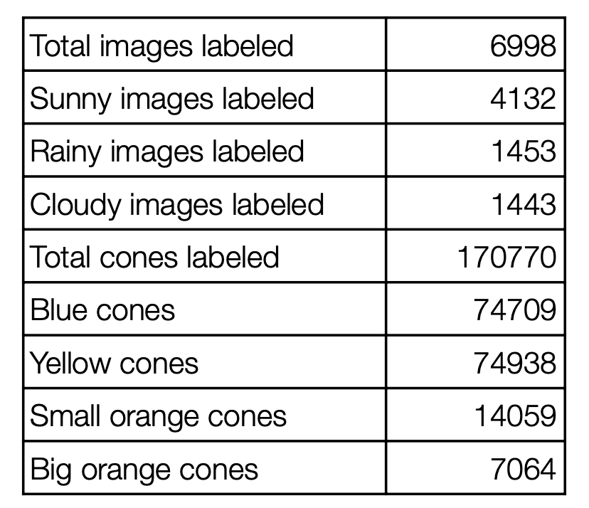
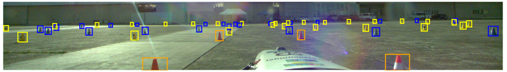
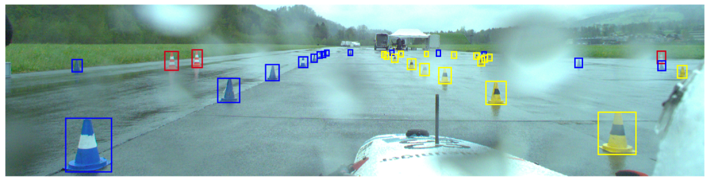

#### KPI
Our custom Ground Truth Measurement Device, which uses a GNSS receiver capable of real-time kinematic, providing a sub-centimeter accuracy in geographic coordinate systems, tagging cones in a shared frame with the GNSS mounted on the car.
Likewise we use a GPS antenna mounted on the car to collect the vehicle position in real time. We then synchronize the timestamps between GNSS and cone array outputs to evaluate our pipeline in different distance ranges with various metrics such as precision, recall, F1 scores and mean position error.
KPI visualization of current frame: left tops shows the statistical result while right part shows the graph demonstration. The car position, correctly predicted cone and wrongly

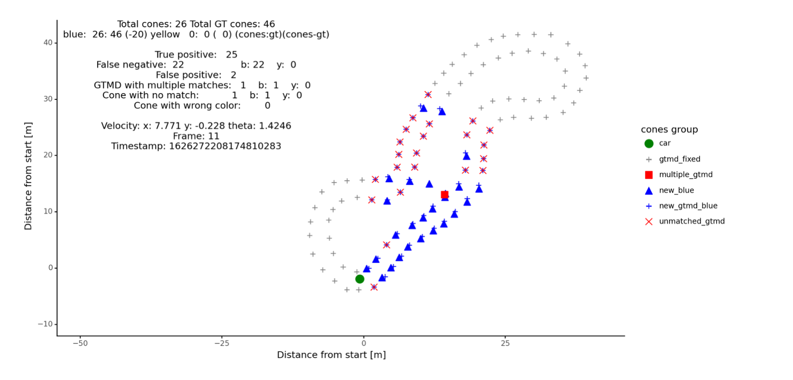

#### C++ deployment in racing car
The network is deployed using ONNX framework for efficient inference, achieving inference times less than 60ms, while detecting cones accurately up to a depth of 40m. Approx- imate depth of the cones is estimated using the height of bounding box as a proxy.

 

#### Android deployment with phone
To test further our YOLO model I also implement it with Android cellphone through JAVA. This can take image from competition directly and check whether cones can be detected smoothly. This is very important because the cones are in different shape and apperance in different competitions. Implementation like this can give us fast feedback for using different models.

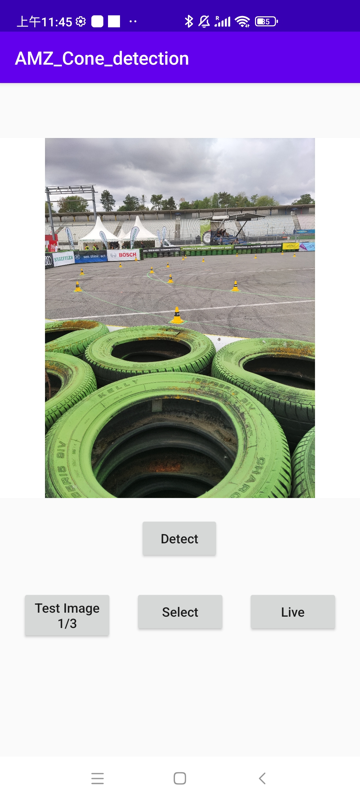 
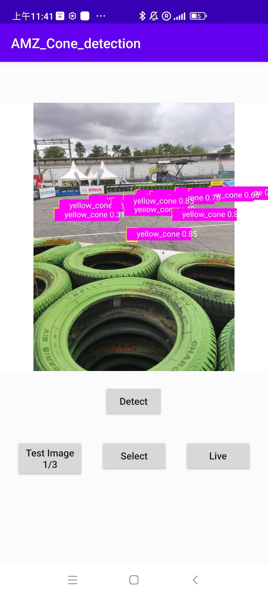 

### 3D sensor fusion detection
Above we discussed how we get 2D bounding box and color from images. However, to build map for the track we need 3D location/depth of the cone. We use sensor fusion technique and combines the advantages of camera and lidar. We project the 3D points to 2D camera image plane so that we can filter out points outside the bounding boxes and only keep the points on the cone surface. In this way, we have the accurate class and distance of the cone.

#### Camera depth approximation
The approximate depth estimation from YOLO is shown in figure below. The distance is not accurate for the long range. So we only use this distance as a proxy in case of the cone occlusion or false positive.

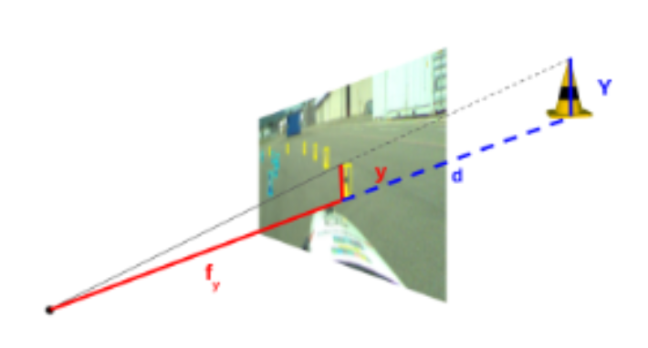 

#### Ground removal using RANSAC
As figure below shows. We filter out ground points to accelerate the downsteam tasks like points egomotion compensation. You can see that most points from lidar is from ground. We use ransac to fit a plane with fine tune parameters of iterations and threshold so we have 99.9% successful rate of choosing the inlier points for the plane fitting.

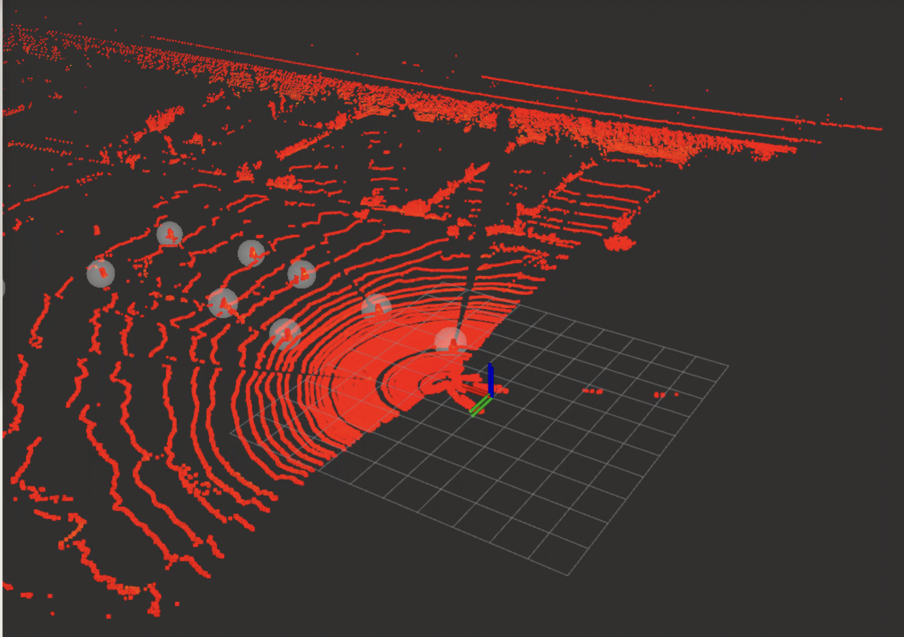 

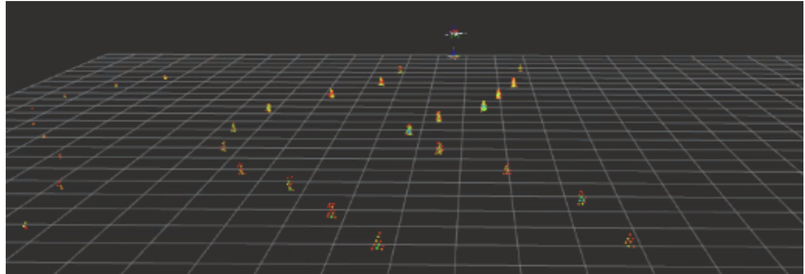 

#### Sequential fusion
As the [video](https://youtu.be/6RJvNTTBE6g) shows we fuse the results of camera and lidar in the sequentail fusion. Basically for the sensor fusion pipeline we project the processed points (ground removal and motion compensation) are projected onto the image bounding boxes. 

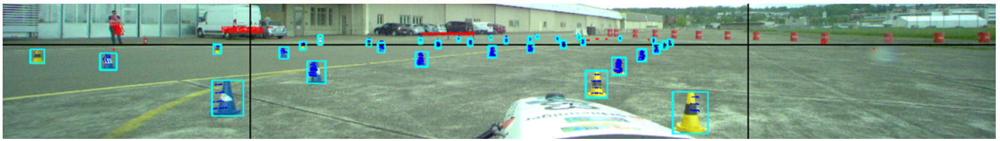 

## Conclusion

I really learned a lot during this experience. We set the goal and achieved it in the end. I believe there are still many challenges, but AMZ will always keep going forward